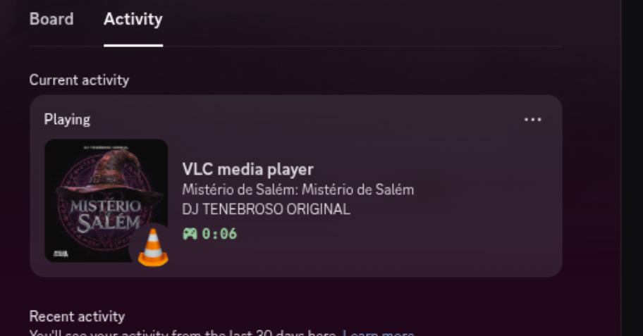

# vlc rpc

this folder is my work to make VLC Media Player work with the Discord Rich presence on my local laptop

Note that im using aRPC, daemonized with PM2.

vlc script to put in:
~/.local/share/vlc/lua/extensions/

the golang watcher is daemonized with pm2

## result:

